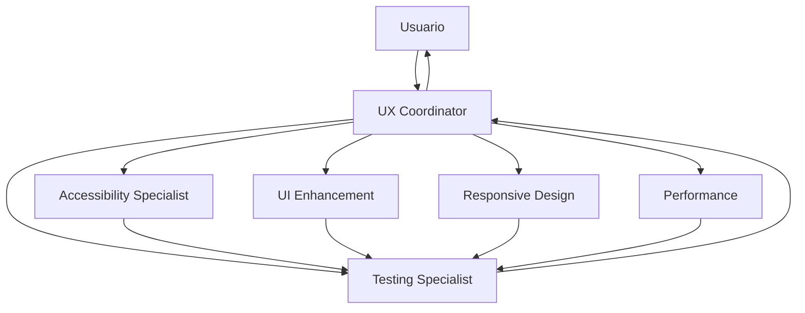
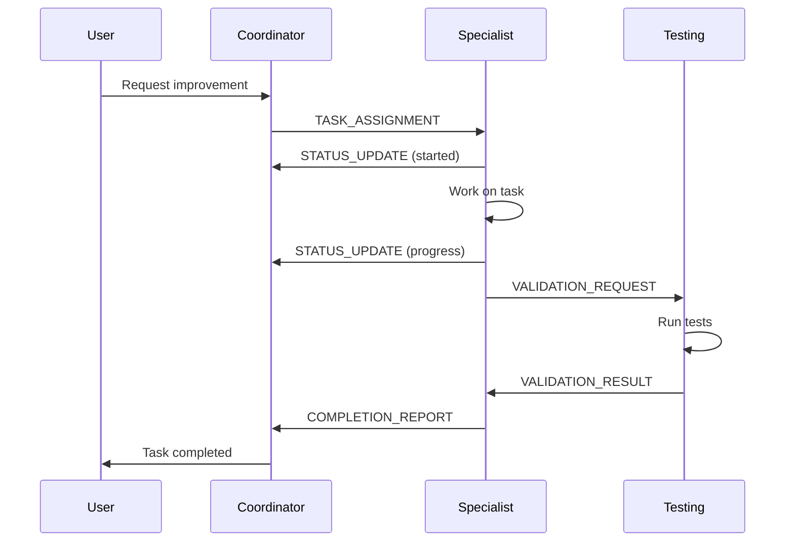
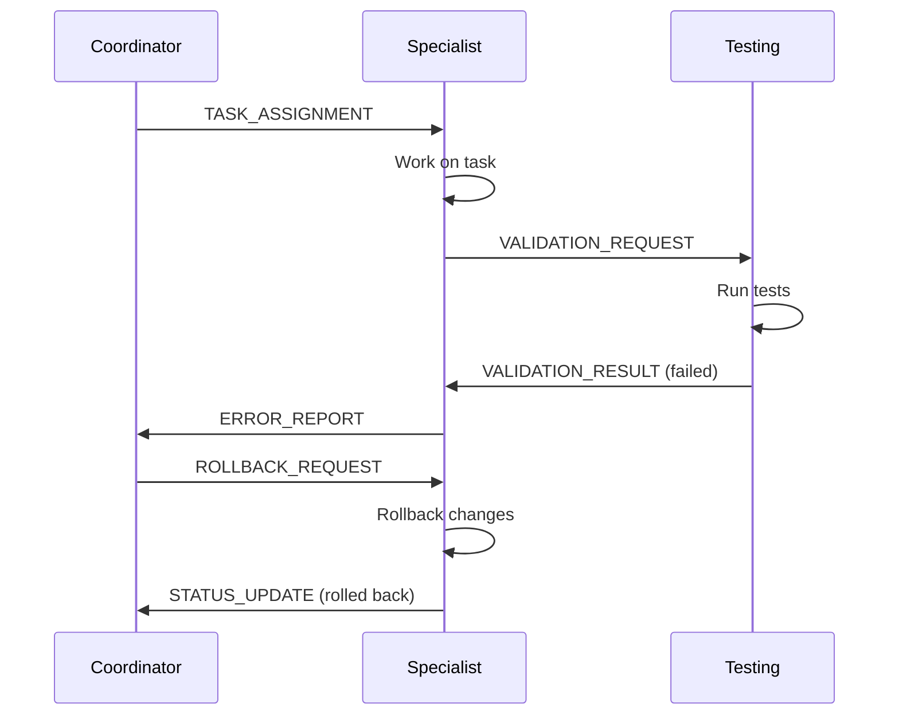

# 🔄 Agent Communication Protocol
## Sistema de Comunicación y Coordinación Inter-Agente

---

## 📡 ARQUITECTURA DE COMUNICACIÓN



---

## 📋 FORMATO DE MENSAJES

### Estructura Base de Mensaje
```typescript
interface AgentMessage {
  // Metadatos
  id: string;                    // UUID único del mensaje
  timestamp: string;              // ISO-8601 timestamp
  version: '1.0';                // Versión del protocolo

  // Remitente/Destinatario
  from: AgentType;              // Agente que envía
  to: AgentType | 'broadcast';  // Destinatario o broadcast

  // Contenido
  type: MessageType;             // Tipo de mensaje
  priority: Priority;            // Urgencia del mensaje
  payload: any;                  // Datos específicos del mensaje

  // Control
  requiresResponse: boolean;     // Si espera respuesta
  responseTimeout?: number;      // Timeout en ms
  correlationId?: string;        // ID del mensaje original (si es respuesta)
}

type AgentType =
  | 'coordinator'
  | 'accessibility-specialist'
  | 'ui-enhancement-specialist'
  | 'responsive-specialist'
  | 'performance-specialist'
  | 'testing-specialist';

type MessageType =
  | 'TASK_ASSIGNMENT'
  | 'STATUS_UPDATE'
  | 'VALIDATION_REQUEST'
  | 'VALIDATION_RESULT'
  | 'ERROR_REPORT'
  | 'ROLLBACK_REQUEST'
  | 'COMPLETION_REPORT'
  | 'HELP_REQUEST'
  | 'BROADCAST_INFO';

type Priority = 'CRITICAL' | 'HIGH' | 'MEDIUM' | 'LOW';
```

---

## 📝 TIPOS DE MENSAJES

### 1. TASK_ASSIGNMENT (Coordinator → Specialist)
```json
{
  "id": "task_001",
  "timestamp": "2024-01-15T10:00:00Z",
  "version": "1.0",
  "from": "coordinator",
  "to": "accessibility-specialist",
  "type": "TASK_ASSIGNMENT",
  "priority": "CRITICAL",
  "requiresResponse": true,
  "responseTimeout": 300000,
  "payload": {
    "taskId": "fix-color-contrast",
    "description": "Corregir contrastes de color para WCAG AA",
    "files": ["app/globals.css"],
    "requirements": {
      "wcag_level": "AA",
      "min_contrast_ratio": 4.5
    },
    "deadline": "2024-01-15T12:00:00Z",
    "dependencies": [],
    "validation_criteria": [
      "lighthouse_accessibility >= 90",
      "no_typescript_errors",
      "tests_passing"
    ]
  }
}
```

### 2. STATUS_UPDATE (Specialist → Coordinator)
```json
{
  "id": "status_001",
  "timestamp": "2024-01-15T10:15:00Z",
  "version": "1.0",
  "from": "accessibility-specialist",
  "to": "coordinator",
  "type": "STATUS_UPDATE",
  "priority": "MEDIUM",
  "correlationId": "task_001",
  "requiresResponse": false,
  "payload": {
    "taskId": "fix-color-contrast",
    "status": "IN_PROGRESS",
    "progress": 45,
    "currentAction": "Modificando variables CSS",
    "estimatedCompletion": "2024-01-15T10:45:00Z",
    "blockers": []
  }
}
```

### 3. VALIDATION_REQUEST (Specialist → Testing)
```json
{
  "id": "val_req_001",
  "timestamp": "2024-01-15T10:30:00Z",
  "version": "1.0",
  "from": "ui-enhancement-specialist",
  "to": "testing-specialist",
  "type": "VALIDATION_REQUEST",
  "priority": "HIGH",
  "requiresResponse": true,
  "responseTimeout": 60000,
  "payload": {
    "taskId": "add-toast-system",
    "changes": [
      {
        "file": "components/ui/feedback-system.tsx",
        "type": "CREATED",
        "lines": 120
      },
      {
        "file": "app/globals.css",
        "type": "MODIFIED",
        "lines_added": 45,
        "lines_removed": 0
      }
    ],
    "tests_to_run": [
      "accessibility",
      "visual_regression",
      "performance",
      "unit_tests"
    ],
    "validation_criteria": {
      "no_regression": true,
      "performance_threshold": 0.1,
      "accessibility_min": 90
    }
  }
}
```

### 4. VALIDATION_RESULT (Testing → Specialist)
```json
{
  "id": "val_res_001",
  "timestamp": "2024-01-15T10:35:00Z",
  "version": "1.0",
  "from": "testing-specialist",
  "to": "ui-enhancement-specialist",
  "type": "VALIDATION_RESULT",
  "priority": "HIGH",
  "correlationId": "val_req_001",
  "requiresResponse": false,
  "payload": {
    "taskId": "add-toast-system",
    "result": "PASSED",
    "tests": {
      "accessibility": {
        "status": "PASSED",
        "score": 95,
        "violations": []
      },
      "visual_regression": {
        "status": "PASSED",
        "difference": 0.8
      },
      "performance": {
        "status": "PASSED",
        "metrics": {
          "fcp_delta": "+20ms",
          "lcp_delta": "+15ms",
          "cls_delta": "0"
        }
      },
      "unit_tests": {
        "status": "PASSED",
        "passed": 156,
        "failed": 0
      }
    },
    "recommendations": [
      "Consider adding animation duration control"
    ]
  }
}
```

### 5. ERROR_REPORT (Any → Coordinator)
```json
{
  "id": "error_001",
  "timestamp": "2024-01-15T10:40:00Z",
  "version": "1.0",
  "from": "responsive-specialist",
  "to": "coordinator",
  "type": "ERROR_REPORT",
  "priority": "CRITICAL",
  "requiresResponse": true,
  "payload": {
    "taskId": "optimize-mobile-nav",
    "error": {
      "type": "BUILD_FAILURE",
      "message": "TypeScript compilation failed",
      "details": "Property 'isOpen' does not exist on type 'NavProps'",
      "file": "components/ui/mobile-nav.tsx",
      "line": 45,
      "column": 12
    },
    "attempted_fixes": [
      "Added missing property to interface",
      "Checked imports"
    ],
    "requires_assistance": true,
    "suggested_action": "ROLLBACK"
  }
}
```

### 6. ROLLBACK_REQUEST (Coordinator/Testing → All)
```json
{
  "id": "rollback_001",
  "timestamp": "2024-01-15T10:45:00Z",
  "version": "1.0",
  "from": "testing-specialist",
  "to": "broadcast",
  "type": "ROLLBACK_REQUEST",
  "priority": "CRITICAL",
  "requiresResponse": true,
  "responseTimeout": 5000,
  "payload": {
    "reason": "Critical regression detected",
    "affected_tasks": [
      "add-animations",
      "optimize-transitions"
    ],
    "rollback_to": {
      "commit": "abc123def",
      "timestamp": "2024-01-15T09:00:00Z"
    },
    "impact": {
      "severity": "HIGH",
      "affected_components": ["navigation", "buttons"],
      "user_facing": true
    },
    "immediate_action_required": true
  }
}
```

---

## 🔄 FLUJO DE TRABAJO

### Secuencia Normal


### Secuencia con Error


---

## 📦 IMPLEMENTACIÓN CON MCP MEMORY

### Inicialización del Sistema
```javascript
// Usar MCP Memory para persistir estado entre sesiones
await mcp__memory__create_entities([
  {
    type: 'agent_communication',
    name: 'UX_Improvement_Session',
    metadata: {
      started_at: new Date().toISOString(),
      agents: [
        'coordinator',
        'accessibility-specialist',
        'ui-enhancement-specialist',
        'responsive-specialist',
        'performance-specialist',
        'testing-specialist'
      ],
      protocol_version: '1.0'
    }
  }
]);
```

### Envío de Mensaje
```javascript
async function sendMessage(message: AgentMessage) {
  // Validar estructura del mensaje
  validateMessageStructure(message);

  // Guardar en memoria
  await mcp__memory__add_observations([{
    entity_id: 'UX_Improvement_Session',
    observation: JSON.stringify({
      type: 'MESSAGE_SENT',
      message
    })
  }]);

  // Log para debugging
  console.log(`[${message.from} → ${message.to}] ${message.type}: ${message.id}`);

  // Si requiere respuesta, establecer timeout
  if (message.requiresResponse) {
    setTimeout(() => {
      checkForResponse(message.id, message.responseTimeout);
    }, message.responseTimeout || 60000);
  }

  return message.id;
}
```

### Recepción de Mensaje
```javascript
async function receiveMessage(agentId: string): Promise<AgentMessage[]> {
  // Recuperar mensajes de memoria
  const messages = await mcp__memory__search_entities({
    query: `to:${agentId} OR to:broadcast`,
    type: 'agent_communication'
  });

  // Filtrar mensajes no procesados
  const unprocessed = messages.filter(msg => !msg.processed);

  // Marcar como procesados
  for (const msg of unprocessed) {
    await mcp__memory__add_observations([{
      entity_id: msg.id,
      observation: JSON.stringify({
        processed_by: agentId,
        processed_at: new Date().toISOString()
      })
    }]);
  }

  return unprocessed;
}
```

---

## 🔐 REGLAS DE COMUNICACIÓN

### 1. Jerarquía de Autoridad
```yaml
coordinator:
  can_command: [all_specialists]
  can_override: [all_specialists]
  reports_to: [user]

testing-specialist:
  can_command: []
  can_override: [all_specialists] # Veto power
  reports_to: [coordinator]

specialists:
  can_command: []
  can_override: []
  reports_to: [coordinator, testing-specialist]
```

### 2. Prioridades de Mensaje
- **CRITICAL**: Respuesta inmediata requerida (< 1 min)
- **HIGH**: Respuesta rápida (< 5 min)
- **MEDIUM**: Respuesta normal (< 15 min)
- **LOW**: Respuesta cuando sea posible

### 3. Timeouts y Reintentos
```javascript
const timeoutConfig = {
  CRITICAL: {
    timeout: 60000,      // 1 minuto
    retries: 3,
    backoff: 1000       // 1 segundo entre reintentos
  },
  HIGH: {
    timeout: 300000,     // 5 minutos
    retries: 2,
    backoff: 5000
  },
  MEDIUM: {
    timeout: 900000,     // 15 minutos
    retries: 1,
    backoff: 10000
  },
  LOW: {
    timeout: 3600000,    // 1 hora
    retries: 0,
    backoff: 0
  }
};
```

### 4. Manejo de Conflictos
```javascript
function resolveConflict(messages: AgentMessage[]) {
  // Ordenar por prioridad y timestamp
  const sorted = messages.sort((a, b) => {
    if (a.priority !== b.priority) {
      const priorityOrder = { CRITICAL: 0, HIGH: 1, MEDIUM: 2, LOW: 3 };
      return priorityOrder[a.priority] - priorityOrder[b.priority];
    }
    return new Date(a.timestamp).getTime() - new Date(b.timestamp).getTime();
  });

  // Testing specialist tiene prioridad absoluta
  const testingMessage = sorted.find(m => m.from === 'testing-specialist');
  if (testingMessage?.type === 'ROLLBACK_REQUEST') {
    return testingMessage; // Veto power
  }

  // Coordinator tiene siguiente prioridad
  const coordinatorMessage = sorted.find(m => m.from === 'coordinator');
  if (coordinatorMessage) {
    return coordinatorMessage;
  }

  // Resto por orden
  return sorted[0];
}
```

---

## 🚨 PROTOCOLO DE EMERGENCIA

### Broadcast de Emergencia
```javascript
async function broadcastEmergency(issue: string, severity: 'CRITICAL' | 'HIGH') {
  const message: AgentMessage = {
    id: `emergency_${Date.now()}`,
    timestamp: new Date().toISOString(),
    version: '1.0',
    from: 'coordinator',
    to: 'broadcast',
    type: 'BROADCAST_INFO',
    priority: 'CRITICAL',
    requiresResponse: true,
    responseTimeout: 5000,
    payload: {
      alert: 'EMERGENCY_STOP',
      issue,
      severity,
      action_required: 'STOP_ALL_OPERATIONS',
      respond_with: 'ACKNOWLEDGED'
    }
  };

  await sendMessage(message);

  // Esperar confirmación de todos los agentes
  const confirmations = await waitForAllResponses(message.id, 5000);

  if (confirmations.length < 5) {
    console.error('⚠️ No todos los agentes respondieron al emergency stop');
  }
}
```

---

## 📊 MONITOREO Y MÉTRICAS

### Dashboard de Comunicación
```javascript
async function getCommunicationMetrics() {
  const session = await mcp__memory__search_entities({
    type: 'agent_communication',
    name: 'UX_Improvement_Session'
  });

  const messages = session.observations;

  return {
    total_messages: messages.length,
    by_type: groupBy(messages, 'type'),
    by_agent: groupBy(messages, 'from'),
    average_response_time: calculateAvgResponseTime(messages),
    failed_validations: messages.filter(m =>
      m.type === 'VALIDATION_RESULT' && m.payload.result === 'FAILED'
    ).length,
    rollbacks: messages.filter(m => m.type === 'ROLLBACK_REQUEST').length,
    critical_errors: messages.filter(m =>
      m.type === 'ERROR_REPORT' && m.priority === 'CRITICAL'
    ).length
  };
}
```

---

## ✅ CHECKLIST DE IMPLEMENTACIÓN

Para que un agente esté correctamente integrado:

- [ ] Puede enviar mensajes según el formato especificado
- [ ] Puede recibir y procesar mensajes dirigidos a él
- [ ] Responde a mensajes que requieren respuesta
- [ ] Maneja broadcasts de emergencia
- [ ] Valida estructura de mensajes entrantes/salientes
- [ ] Implementa timeouts y reintentos
- [ ] Registra todas las comunicaciones en MCP Memory
- [ ] Respeta la jerarquía de autoridad
- [ ] Implementa rollback cuando se solicita
- [ ] Reporta errores al coordinador

Este protocolo asegura comunicación confiable, trazable y ordenada entre todos los agentes del sistema.