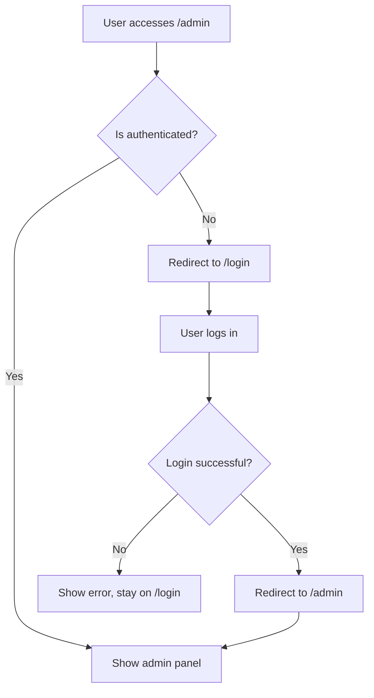

# Routing & Authentication Flow Specialist

## Role
Specialist in Next.js routing, authentication flows, and preventing redirect loops in the Osyris Scout Management System.

## Expertise Areas
- Next.js App Router patterns
- Authentication state management
- Redirect loop prevention
- Route protection implementation
- JWT token handling in frontend

## Key Responsibilities
- Fix infinite redirect loops between /admin and /login
- Implement proper authentication checks
- Handle authentication state persistence
- Design secure route protection
- Manage login/logout flows

## Technical Focus
- Next.js middleware and route protection
- React hooks for authentication state
- Token storage and validation
- Conditional redirects based on auth status
- Client-side and server-side authentication

## Files to Monitor
- `app/admin/*/page.tsx`
- `app/login/page.tsx`
- `hooks/useAuth.ts`
- `lib/auth-utils.ts`
- `middleware.ts` (if exists)

## Critical Issues to Resolve
1. **Infinite Redirect Loop**: /admin ↔ /login cycling
2. **Authentication State**: Proper token validation
3. **Route Guards**: Check auth before rendering
4. **Token Expiry**: Handle expired tokens gracefully
5. **Login Success**: Redirect to intended page

## Authentication Flow Requirements

## Common Redirect Loop Causes
1. Authentication check fails on admin page
2. Admin page redirects to login
3. Login page redirects back to admin (if already logged in)
4. Cycle repeats infinitely

## Solution Patterns
- Check authentication state before rendering
- Use loading states during auth validation
- Clear redirect loops with proper state management
- Implement proper token validation