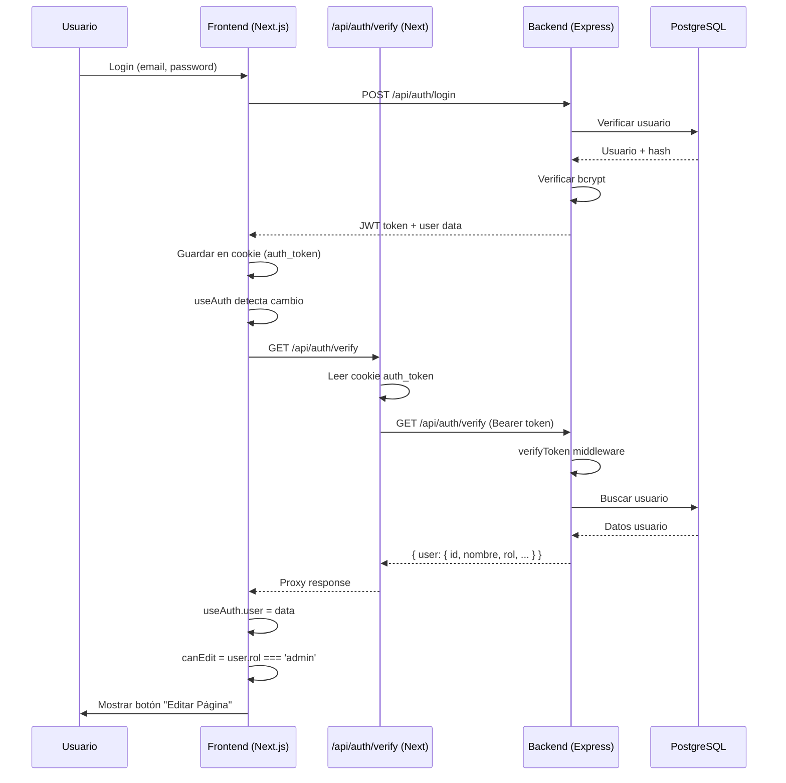
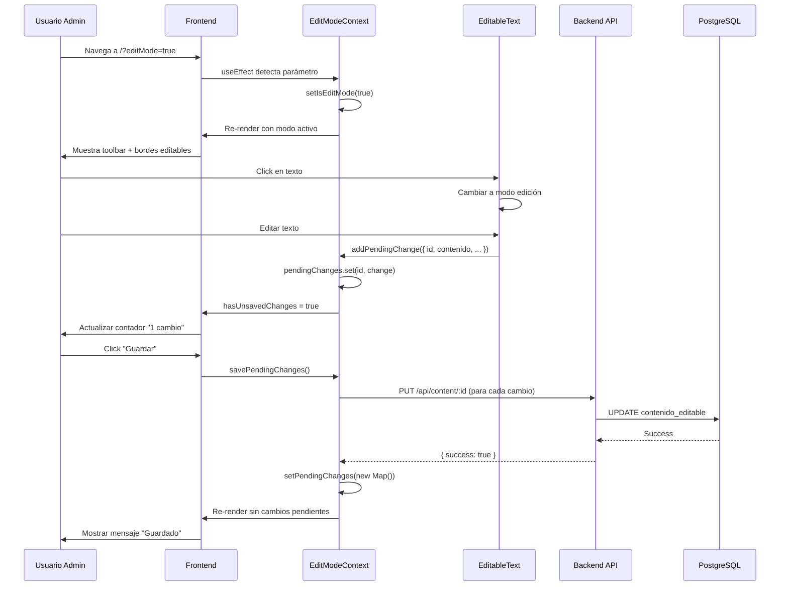

# 📝 Resumen de Implementación - Sistema de Edición en Vivo

**Fecha:** 4 de octubre de 2025
**Autor:** Claude Code
**Objetivo:** Resolver el problema de autenticación y hacer funcional el sistema de edición en vivo

---

## 🎯 Problema Original

El botón "Editar Página" no aparecía en la interfaz porque:

1. **Faltaba ruta de verificación:** `useAuth` intentaba llamar a `GET /api/auth/verify` pero no existía en Next.js
2. **El hook limpiaba la sesión:** Al recibir 404, `useAuth` borraba el token y marcaba `user = null`
3. **canEdit evaluaba a false:** Sin usuario, `canEdit = isAdmin || isEditor` era siempre `false`
4. **EditModeToggle no renderizaba:** El componente retornaba `null` cuando `canEdit === false`

---

## ✅ Soluciones Implementadas

### 1. Ruta de Verificación de Autenticación

**Archivo creado:** `app/api/auth/verify/route.ts`

```typescript
export async function GET() {
  // Lee cookie auth_token
  const token = cookieStore.get('auth_token')?.value

  // Proxy al backend
  const response = await fetch(`${backendUrl}/api/auth/verify`, {
    headers: { 'Authorization': `Bearer ${token}` }
  })

  // Retorna información del usuario
  return NextResponse.json({ user: userData })
}
```

**Funcionalidad:**
- ✅ Actúa como proxy entre frontend y backend
- ✅ Lee el token de las cookies
- ✅ Verifica con el backend en puerto 5000
- ✅ Retorna datos del usuario autenticado
- ✅ Limpia cookie si el token es inválido

---

### 2. Corrección del useEffect de EditMode

**Archivo modificado:** `contexts/EditModeContext.tsx`

**Cambios:**
1. **Movido useRef al inicio del componente** (línea 57)
   ```typescript
   const processedEditModeParam = React.useRef(false);
   ```

2. **Agregado reset del ref en `disableEditMode`** (líneas 83-89)
   ```typescript
   const disableEditMode = useCallback(() => {
     setIsEditMode(false);
     // Resetear el ref para permitir reactivación
     if (processedEditModeParam.current) {
       processedEditModeParam.current = false;
     }
   }, []);
   ```

**Funcionalidad:**
- ✅ El parámetro `?editMode=true` se procesa solo una vez
- ✅ Al salir del modo edición, el ref se resetea
- ✅ Permite volver a entrar con `?editMode=true` sin recargar

---

### 3. Integración de Componentes Editables en Landing

**Archivo modificado:** `app/page.tsx`

**Cambios:**
1. **Importado EditableImage** (línea 9)
   ```typescript
   import { EditableImage } from "@/components/editable/EditableImage"
   ```

2. **Añadido EditableImage en sección "Join Us"** (líneas 303-310)
   ```tsx
   <EditableImage
     contentId={9}
     identificador="join-us-image"
     seccion="landing"
     src="/placeholder.svg?height=300&width=400"
     alt="Grupo Scout Osyris"
     className="rounded-lg"
   />
   ```

**Funcionalidad:**
- ✅ La landing page ya tiene 8 bloques de texto editables
- ✅ 1 imagen editable
- ✅ Listo para edición en vivo inmediata

---

### 4. Verificación de Endpoints Backend

**Archivos verificados:**
- `api-osyris/src/routes/content.routes.js` ✅
- `api-osyris/src/controllers/content.controller.js` ✅
- `api-osyris/src/middleware/auth.middleware.js` ✅
- `api-osyris/src/index.js` ✅

**Endpoints disponibles:**
```
GET    /api/content/page/:seccion      - Obtener contenido de página
GET    /api/content/:id                - Obtener contenido por ID
PUT    /api/content/:id                - Actualizar contenido (admin/editor)
POST   /api/content                    - Crear contenido (admin/editor)
POST   /api/content/upload             - Subir imagen (admin/editor)
GET    /api/content/history/:id        - Ver historial (admin/editor)
POST   /api/content/restore/:id/:v     - Restaurar versión (admin)
DELETE /api/content/:id                - Eliminar contenido (admin)
```

**Funcionalidad:**
- ✅ Todos los endpoints necesarios existen
- ✅ Middleware `requireRole(['admin', 'editor'])` correcto
- ✅ Controlador implementado con PostgreSQL
- ✅ Rutas registradas en `app.use('/api/content', contentRoutes)`

---

### 5. Scripts de Base de Datos

**Archivos creados:**

#### `api-osyris/database/seed-landing-content.sql`
- Inserta 9 bloques de contenido para la landing page
- Usa `ON CONFLICT DO UPDATE` para ser idempotente
- Incluye metadata para cada elemento editable

**Contenido insertado:**
```sql
ID 1: hero-title (texto)
ID 2: hero-subtitle (texto)
ID 3: feature-1-title (texto)
ID 4: feature-1-description (texto)
ID 5: feature-2-title (texto)
ID 6: feature-2-description (texto)
ID 7: feature-3-title (texto)
ID 8: feature-3-description (texto)
ID 9: join-us-image (imagen)
```

---

## 📚 Documentación Creada

### 1. GUIA_PRUEBA_EDICION.md
- Guía completa paso a paso
- Instrucciones para setup de BD
- Creación de usuario admin
- Flujo de prueba completo
- Troubleshooting detallado
- Checklist de funcionalidad

### 2. DONDE_VER_LOS_CAMBIOS.md (actualizado)
- Resumen de cambios implementados
- Instrucciones simplificadas
- URLs correctas vs incorrectas
- Troubleshooting básico
- Enlaces a documentación completa

### 3. RESUMEN_IMPLEMENTACION.md (este archivo)
- Resumen técnico de cambios
- Archivos modificados/creados
- Código relevante
- Próximos pasos sugeridos

---

## 🔄 Flujo de Autenticación (Actual)



---

## 🔄 Flujo de Edición (Actual)



---

## 🚀 Próximos Pasos Sugeridos

### Corto Plazo (1-2 días)

1. **Probar flujo completo**
   - Ejecutar scripts de base de datos
   - Crear usuario admin
   - Probar edición de texto
   - Probar edición de imagen
   - Verificar persistencia

2. **Crear usuario admin de producción**
   - Generar hash seguro de contraseña
   - Insertar en base de datos de producción
   - Probar login en producción

### Medio Plazo (1 semana)

3. **Extender a otras páginas**
   - Contacto (`/contacto`)
   - Sobre Nosotros (`/sobre-nosotros`)
   - Secciones individuales (castores, manada, etc.)

4. **Implementar preview de cambios**
   - Modo preview antes de guardar
   - Comparación lado a lado
   - Rollback visual

5. **Mejorar UX de edición**
   - Animaciones suaves
   - Feedback visual mejorado
   - Atajos de teclado (Ctrl+S para guardar)
   - Confirmación al salir con cambios sin guardar

### Largo Plazo (1 mes)

6. **Sistema de aprobación**
   - Rol "editor" puede crear cambios
   - Rol "admin" debe aprobar
   - Flujo de revisión

7. **Historial y rollback**
   - Ver versiones anteriores
   - Restaurar versión específica
   - Comparar diferencias

8. **Métricas y auditoría**
   - Quién editó qué y cuándo
   - Dashboard de actividad
   - Reportes de cambios

---

## 📊 Estado del Sistema

### ✅ Completado

- [x] Ruta de verificación de autenticación
- [x] Corrección de useEffect en EditModeContext
- [x] Integración de componentes editables en landing
- [x] Verificación de endpoints backend
- [x] Scripts de base de datos para contenido inicial
- [x] Documentación completa

### 🔄 En Progreso

- [ ] Pruebas del flujo completo
- [ ] Creación de usuario admin

### 📋 Pendiente

- [ ] Extensión a otras páginas
- [ ] Sistema de preview
- [ ] Sistema de aprobación
- [ ] Historial y rollback
- [ ] Métricas y auditoría

---

## 🛠️ Archivos Modificados/Creados

### Creados

```
app/api/auth/verify/route.ts
api-osyris/database/seed-landing-content.sql
GUIA_PRUEBA_EDICION.md
RESUMEN_IMPLEMENTACION.md
```

### Modificados

```
contexts/EditModeContext.tsx
app/page.tsx
DONDE_VER_LOS_CAMBIOS.md
```

### Verificados (sin cambios)

```
api-osyris/src/routes/content.routes.js
api-osyris/src/controllers/content.controller.js
api-osyris/src/middleware/auth.middleware.js
api-osyris/src/index.js
components/editable/EditableText.tsx
components/editable/EditableImage.tsx
```

---

## 🎓 Lecciones Aprendidas

1. **Siempre verificar rutas de API:** Un 404 silencioso puede causar que todo el sistema de autenticación falle.

2. **useRef es esencial para parámetros URL:** Sin él, el useEffect se ejecuta infinitamente.

3. **Resetear refs al cambiar estado:** Si usas un ref como flag, debes resetearlo cuando el estado cambia.

4. **Proxy entre frontend y backend:** Next.js Route Handlers son perfectos para ocultar tokens y gestionar cookies.

5. **Documentación completa es crucial:** Una guía paso a paso hace que cualquier problema sea reproducible y solucionable.

---

**Fin del documento**

Para más información, consulta:
- [GUIA_PRUEBA_EDICION.md](GUIA_PRUEBA_EDICION.md)
- [DONDE_VER_LOS_CAMBIOS.md](DONDE_VER_LOS_CAMBIOS.md)
- [DIAGNOSTICO_EDICION.md](DIAGNOSTICO_EDICION.md)
