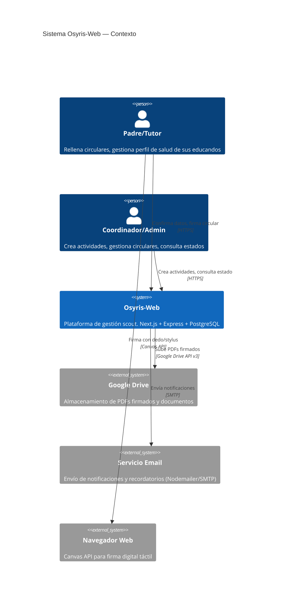
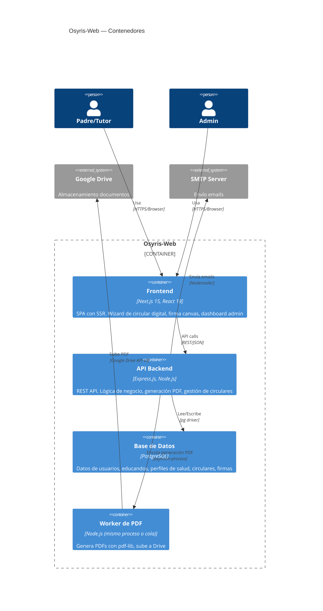
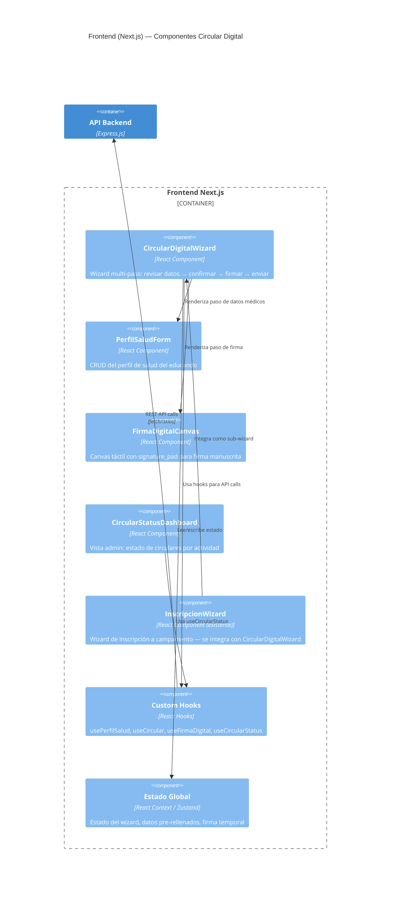
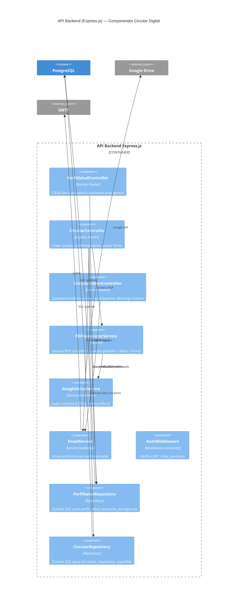
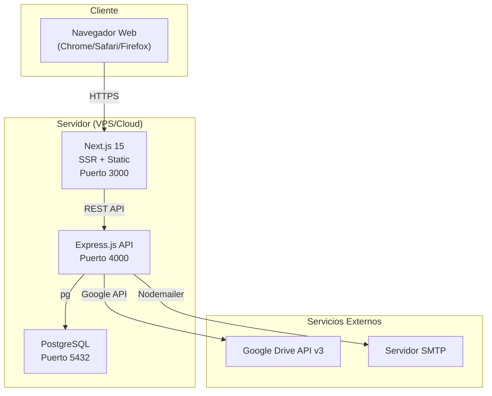
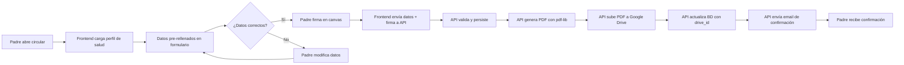

# Diagramas C4 — Circular Digital

> Arquitectura del sistema Osyris-Web con la feature Circular Digital integrada.  
> Formato: Mermaid. Nivel C4: Context, Container, Component.

**Fecha:** 2026-02-01  
**Estado:** Draft  

---

## 1. Diagrama de Contexto (C4 Level 1)

Muestra cómo Osyris-Web interactúa con usuarios y sistemas externos.

---

## 2. Diagrama de Contenedores (C4 Level 2)

Muestra los contenedores técnicos del sistema y cómo se comunican.

---

## 3. Diagrama de Componentes — Frontend (C4 Level 3)

---

## 4. Diagrama de Componentes — Backend API (C4 Level 3)

---

## 5. Diagrama de Despliegue

---

## 6. Flujo de Datos — Vista General

