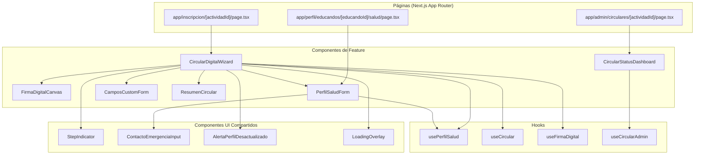

# Componentes React — Circular Digital

> Especificación de los nuevos componentes React necesarios para la feature.

**Fecha:** 2026-02-01  
**Estado:** Draft  

---

## 1. Mapa de Componentes



---

## 2. CircularDigitalWizard

**Ubicación:** `components/circular-digital/CircularDigitalWizard.tsx`  
**Responsabilidad:** Wizard multi-paso para confirmar datos y firmar una circular digital.

### Props

```typescript
interface CircularDigitalWizardProps {
  actividadId: number;
  educandoId: number;
  familiarId: number;
  onComplete: (resultado: CircularResultado) => void;
  onCancel: () => void;
  /** Si viene del wizard de inscripción, se integra como sub-wizard */
  embedded?: boolean;
  /** Paso inicial (para retomar desde donde se dejó) */
  initialStep?: number;
}

interface CircularResultado {
  success: boolean;
  circularRespuestaId: number;
  pdfUrl: string;
  pdfDriveId: string;
}
```

### Estado Interno

```typescript
interface WizardState {
  currentStep: number; // 0-5
  perfilSalud: PerfilSaludData | null;
  contactosEmergencia: ContactoEmergencia[];
  camposCustomRespuestas: Record<string, any>;
  firmaBase64: string | null;
  aceptaCondiciones: boolean;
  datosModificados: boolean; // true si padre cambió algo del perfil
  actualizarPerfil: boolean; // true si padre quiere persistir cambios
  isSubmitting: boolean;
  error: string | null;
}
```

### Pasos del Wizard

| Paso | Componente Renderizado | Descripción |
|------|----------------------|-------------|
| 0 | `DatosEducando` (solo lectura) | Nombre, edad, sección |
| 1 | `PerfilSaludForm` (editable) | Datos médicos pre-rellenados |
| 2 | `ContactosEmergenciaStep` | Contactos pre-rellenados, editables |
| 3 | `CamposCustomForm` | Campos específicos de la actividad |
| 4 | `ResumenCircular` | Vista previa + checkbox legal |
| 5 | `FirmaDigitalCanvas` | Canvas de firma + botón enviar |

### Comportamiento Clave
- Al montar, hace fetch de perfil de salud + configuración de circular.
- Si no existe perfil de salud, comienza en paso 1 con formulario vacío.
- Si perfil tiene >6 meses, muestra `AlertaPerfilDesactualizado`.
- Guarda progreso en `localStorage` por si se pierde la sesión.
- Al enviar, pregunta si actualizar el perfil de salud con los cambios.

---

## 3. FirmaDigitalCanvas

**Ubicación:** `components/circular-digital/FirmaDigitalCanvas.tsx`  
**Responsabilidad:** Canvas táctil para firma manuscrita usando `signature_pad`.

### Props

```typescript
interface FirmaDigitalCanvasProps {
  /** Callback cuando la firma cambia */
  onChange: (firmaBase64: string | null) => void;
  /** Ancho del canvas (responsive por defecto) */
  width?: number;
  /** Alto del canvas */
  height?: number;
  /** Color del trazo */
  penColor?: string;
  /** Grosor mínimo del trazo */
  minWidth?: number;
  /** Grosor máximo del trazo */
  maxWidth?: number;
  /** Texto mostrado cuando canvas está vacío */
  placeholder?: string;
  /** Deshabilitar interacción */
  disabled?: boolean;
  /** Firma previa para mostrar (modo lectura) */
  initialValue?: string;
  /** Número mínimo de puntos para considerar firma válida */
  minPoints?: number;
}
```

### Estado Interno

```typescript
interface FirmaState {
  isEmpty: boolean;
  pointCount: number;
  isValid: boolean; // pointCount >= minPoints
  canvasRef: RefObject<HTMLCanvasElement>;
  signaturePad: SignaturePad | null;
}
```

### API Expuesta (useImperativeHandle)

```typescript
interface FirmaDigitalCanvasRef {
  /** Limpia el canvas */
  clear: () => void;
  /** Retorna la firma como PNG base64 */
  toDataURL: () => string;
  /** Retorna true si el canvas está vacío */
  isEmpty: () => boolean;
  /** Retorna número de puntos dibujados */
  getPointCount: () => number;
}
```

### Comportamiento Clave
- Se redimensiona automáticamente al contenedor padre (responsive).
- En móvil, previene scroll mientras se firma (`touch-action: none`).
- Muestra texto placeholder "Firme aquí" que desaparece al primer trazo.
- Botón "Limpiar" integrado en esquina superior derecha.
- Indicador visual de validez (borde verde si >minPoints, gris si no).
- Fallback: si `canvas` no está soportado, muestra campo de texto para nombre completo.

### Ejemplo de Uso

```tsx
<FirmaDigitalCanvas
  onChange={(firma) => setFirmaBase64(firma)}
  minPoints={50}
  placeholder="Firme aquí con el dedo o stylus"
  penColor="#1a1a2e"
  height={200}
/>
```

---

## 4. PerfilSaludForm

**Ubicación:** `components/circular-digital/PerfilSaludForm.tsx`  
**Responsabilidad:** Formulario CRUD para el perfil de salud de un educando.

### Props

```typescript
interface PerfilSaludFormProps {
  educandoId: number;
  /** Datos iniciales (pre-rellenado) */
  initialData?: PerfilSaludData;
  /** Contactos de emergencia iniciales */
  initialContactos?: ContactoEmergencia[];
  /** Modo del formulario */
  mode: 'standalone' | 'wizard-step';
  /** Solo lectura */
  readOnly?: boolean;
  /** Callback al guardar (modo standalone) */
  onSave?: (data: PerfilSaludData, contactos: ContactoEmergencia[]) => void;
  /** Callback al cambiar datos (modo wizard) */
  onChange?: (data: PerfilSaludData, contactos: ContactoEmergencia[]) => void;
  /** Mostrar solo campos médicos (sin contactos) */
  hiddenSections?: ('contactos' | 'deportes' | 'tarjeta_sanitaria')[];
}

interface PerfilSaludData {
  alergias: string;
  intolerancias: string;
  dieta_especial: string;
  medicacion: string;
  observaciones_medicas: string;
  grupo_sanguineo: string;
  tarjeta_sanitaria: string;
  enfermedades_cronicas: string;
  puede_hacer_deporte: boolean;
  notas_adicionales: string;
}

interface ContactoEmergencia {
  nombre_completo: string;
  telefono: string;
  relacion: string;
  orden: number;
}
```

### Secciones del Formulario

| Sección | Campos | Notas |
|---------|--------|-------|
| Alergias e intolerancias | `alergias`, `intolerancias` | Textarea con chips/tags |
| Dieta | `dieta_especial` | Select + texto libre |
| Medicación | `medicacion` | Textarea |
| Condiciones médicas | `enfermedades_cronicas`, `observaciones_medicas`, `puede_hacer_deporte` | Checkbox + textarea |
| Datos sanitarios | `grupo_sanguineo`, `tarjeta_sanitaria` | Select + input |
| Contactos de emergencia | Lista de `ContactoEmergencia` | Mín 1, máx 3. Componente `ContactoEmergenciaInput` |

### Comportamiento Clave
- En modo `standalone`: botón "Guardar" que persiste vía API.
- En modo `wizard-step`: notifica cambios al padre (wizard) sin persistir.
- Validación: al menos 1 contacto de emergencia con teléfono válido.
- Campos opcionales no bloquean el envío, pero se muestran con indicador "recomendado".
- Muestra fecha de última actualización si existe.

---

## 5. CircularStatusDashboard

**Ubicación:** `components/circular-digital/admin/CircularStatusDashboard.tsx`  
**Responsabilidad:** Panel admin para visualizar y gestionar el estado de circulares de una actividad.

### Props

```typescript
interface CircularStatusDashboardProps {
  actividadId: number;
}
```

### Estado Interno

```typescript
interface DashboardState {
  inscritos: InscritoConEstado[];
  stats: {
    total: number;
    firmadas: number;
    pendientes: number;
    error: number;
  };
  filtros: {
    estado: 'todos' | 'pendiente' | 'firmada' | 'error';
    seccion: string | null;
    busqueda: string;
  };
  isLoading: boolean;
  isSendingReminders: boolean;
  isDownloading: boolean;
}

interface InscritoConEstado {
  educandoId: number;
  educandoNombre: string;
  educandoApellidos: string;
  seccion: string;
  familiarNombre: string;
  familiarEmail: string;
  estadoCircular: 'pendiente' | 'firmada' | 'archivada' | 'error';
  fechaFirma: string | null;
  pdfDriveId: string | null;
  pdfUrl: string | null;
}
```

### Sub-componentes

```mermaid
graph TD
    CSD[CircularStatusDashboard]
    CSD --> Stats[EstadisticasResumen]
    CSD --> Filtros[BarraFiltros]
    CSD --> Tabla[TablaInscritos]
    CSD --> Acciones[BarraAcciones]

    Stats --> |"Tarjetas con contadores"| StatsCards["✅ Firmadas: N | ⏳ Pendientes: N | ❌ Error: N"]
    Filtros --> FiltroEstado[Select Estado]
    Filtros --> FiltroSeccion[Select Sección]
    Filtros --> FiltroBusqueda[Input Búsqueda]

    Tabla --> FilaInscrito[FilaInscrito]
    FilaInscrito --> BotonVerDetalle[Ver Detalle]
    FilaInscrito --> BotonVerPDF[Ver PDF ↗]
    FilaInscrito --> BotonRecordatorio[Enviar Recordatorio]

    Acciones --> RecordatorioMasivo[Recordatorio Masivo]
    Acciones --> DescargaMasiva[Descargar PDFs (ZIP)]
    Acciones --> VistaEmergencia[Vista Emergencia 🏥]
```

### Acciones del Dashboard

| Acción | Endpoint API | Descripción |
|--------|-------------|-------------|
| Ver detalle | GET `/api/admin/circular/{actId}/respuesta/{educandoId}` | Datos confirmados + firma + PDF |
| Enviar recordatorio individual | POST `/api/admin/circular/{actId}/recordatorio/{educandoId}` | Email al padre |
| Recordatorio masivo | POST `/api/admin/circular/{actId}/recordatorio` | Email a todos los pendientes |
| Descargar PDFs | POST `/api/admin/circular/{actId}/descargar-masivo` | ZIP con todos los PDFs |
| Vista emergencia | GET `/api/admin/circular/{actId}/vista-emergencia` | Resumen médico de todos |

---

## 6. Componentes Auxiliares

### 6.1 CamposCustomForm

```typescript
interface CamposCustomFormProps {
  campos: CampoCustom[];
  respuestas: Record<string, any>;
  onChange: (respuestas: Record<string, any>) => void;
}

interface CampoCustom {
  id: number;
  nombre_campo: string;
  tipo_campo: 'texto' | 'checkbox' | 'select' | 'textarea';
  etiqueta: string;
  obligatorio: boolean;
  opciones: string[] | null; // Para tipo 'select'
  orden: number;
}
```

### 6.2 ResumenCircular

```typescript
interface ResumenCircularProps {
  educando: { nombre: string; apellidos: string; seccion: string };
  perfilSalud: PerfilSaludData;
  contactos: ContactoEmergencia[];
  camposCustom: { etiqueta: string; valor: any }[];
  actividad: { nombre: string; fechas: string };
  onEditStep: (step: number) => void;
}
```

Muestra un resumen de todos los datos con botón "Editar" al lado de cada sección que navega al paso correspondiente del wizard.

### 6.3 ContactoEmergenciaInput

```typescript
interface ContactoEmergenciaInputProps {
  contacto: ContactoEmergencia;
  index: number;
  onChange: (contacto: ContactoEmergencia) => void;
  onRemove: () => void;
  canRemove: boolean; // false si es el único
}
```

### 6.4 AlertaPerfilDesactualizado

```typescript
interface AlertaPerfilDesactualizadoProps {
  ultimaActualizacion: Date;
  onDismiss: () => void;
}
```

Banner amarillo: "Tu perfil de salud fue actualizado hace X meses. Te recomendamos revisarlo."

### 6.5 StepIndicator

```typescript
interface StepIndicatorProps {
  steps: { label: string; completed: boolean }[];
  currentStep: number;
  onStepClick?: (step: number) => void;
}
```

---

## 7. Custom Hooks

### 7.1 usePerfilSalud

```typescript
function usePerfilSalud(educandoId: number) {
  return {
    perfil: PerfilSaludData | null;
    contactos: ContactoEmergencia[];
    isLoading: boolean;
    error: string | null;
    ultimaActualizacion: Date | null;
    necesitaActualizacion: boolean; // >6 meses
    guardar: (data: PerfilSaludData, contactos: ContactoEmergencia[]) => Promise<void>;
    refetch: () => Promise<void>;
  };
}
```

### 7.2 useCircular

```typescript
function useCircular(actividadId: number, educandoId: number) {
  return {
    circularConfig: CircularConfig | null;
    camposCustom: CampoCustom[];
    isLoading: boolean;
    error: string | null;
    firmar: (datos: DatosFirma) => Promise<CircularResultado>;
    estadoActual: string | null; // null si no hay respuesta previa
  };
}
```

### 7.3 useFirmaDigital

```typescript
function useFirmaDigital() {
  return {
    canvasRef: RefObject<FirmaDigitalCanvasRef>;
    firmaBase64: string | null;
    isValid: boolean;
    clear: () => void;
    /** Guarda en localStorage como backup */
    saveToLocal: () => void;
    /** Restaura desde localStorage */
    restoreFromLocal: () => string | null;
  };
}
```

### 7.4 useCircularAdmin

```typescript
function useCircularAdmin(actividadId: number) {
  return {
    inscritos: InscritoConEstado[];
    stats: DashboardStats;
    isLoading: boolean;
    error: string | null;
    enviarRecordatorio: (educandoId?: number) => Promise<{ enviados: number }>;
    descargarPDFs: () => Promise<void>;
    refetch: () => Promise<void>;
  };
}
```

---

## 8. Endpoints API Necesarios

| Método | Endpoint | Descripción | Auth |
|--------|----------|-------------|------|
| GET | `/api/perfil-salud/educando/:educandoId` | Obtener perfil de salud + contactos | Familiar del educando |
| PUT | `/api/perfil-salud/educando/:educandoId` | Actualizar perfil de salud + contactos | Familiar del educando |
| GET | `/api/circular/:actividadId/formulario` | Config circular + datos pre-rellenados | Familiar inscrito |
| POST | `/api/circular/:actividadId/firmar` | Enviar datos confirmados + firma | Familiar inscrito |
| GET | `/api/circular/:actividadId/estado/:educandoId` | Estado de la circular de un educando | Familiar o Admin |
| GET | `/api/admin/circular/:actividadId/estado` | Dashboard estado circulares | Admin/Coordinador |
| POST | `/api/admin/circular/:actividadId/recordatorio` | Enviar recordatorios | Admin/Coordinador |
| POST | `/api/admin/circular/:actividadId/descargar-masivo` | Descargar ZIP de PDFs | Admin/Coordinador |
| GET | `/api/admin/circular/:actividadId/vista-emergencia` | Resumen médico inscritos | Admin/Coordinador |
| POST | `/api/admin/circular/:actividadId/crear` | Crear/configurar circular | Admin |
| PUT | `/api/admin/circular/:actividadId/editar` | Editar circular | Admin |
| GET | `/api/admin/plantillas-circular` | Listar plantillas | Admin |
