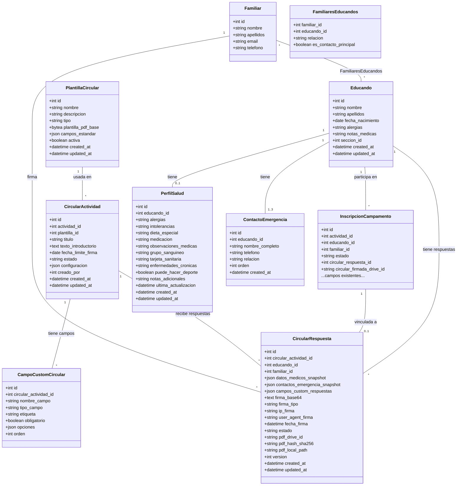

# Modelo de Dominio — Circular Digital

> Entidades nuevas y modificadas, diagrama de clases, y cambios en base de datos.

**Fecha:** 2026-02-01  
**Estado:** Draft  

---

## 1. Entidades del Dominio

### 1.1 Entidades Nuevas

| Entidad | Descripción | Responsabilidad |
|---------|-------------|-----------------|
| **PerfilSalud** | Datos médicos y de salud persistentes de un educando | Almacena alergias, medicación, dieta, grupo sanguíneo, tarjeta sanitaria, enfermedades crónicas |
| **ContactoEmergencia** | Persona de contacto en caso de emergencia | Nombre, teléfono, relación con el educando. Mínimo 1, máximo 3 |
| **PlantillaCircular** | Plantilla reutilizable para circulares | Define los campos estándar y el formato del PDF base |
| **CircularActividad** | Circular asociada a una actividad concreta | Configura la circular para una actividad: plantilla, fecha límite, campos custom, texto |
| **CampoCustomCircular** | Campo personalizado añadido a una circular | Permite al admin añadir preguntas/autorizaciones específicas de la actividad |
| **CircularRespuesta** | Respuesta de un familiar a una circular | Datos confirmados, firma, estado, metadatos de integridad |

### 1.2 Entidades Modificadas

| Entidad | Cambio | Motivo |
|---------|--------|--------|
| **Educando** | Se añade relación 1:1 con PerfilSalud | Centralizar datos médicos fuera de inscripciones |
| **InscripcionCampamento** | Se añade FK a CircularRespuesta | Vincular inscripción con respuesta digital |

---

## 2. Diagrama de Clases

---

## 3. Estados de CircularRespuesta

---

## 4. Estados de CircularActividad

---

## 5. Cambios en Base de Datos (Resumen)

### Tablas Nuevas

| Tabla | Descripción |
|-------|-------------|
| `perfil_salud` | Datos médicos persistentes por educando |
| `contactos_emergencia` | Contactos de emergencia por educando |
| `plantillas_circular` | Plantillas reutilizables de circulares |
| `circular_actividad` | Circular específica para una actividad |
| `campos_custom_circular` | Campos personalizados de una circular |
| `circular_respuesta` | Respuesta/firma de un familiar a una circular |
| `auditoria_datos_medicos` | Log de accesos a datos médicos (RGPD) |

### Tablas Modificadas

| Tabla | Cambio |
|-------|--------|
| `inscripciones_campamento` | Añadir columna `circular_respuesta_id` (FK) |

### Índices Clave

| Tabla | Índice | Tipo |
|-------|--------|------|
| `perfil_salud` | `(educando_id)` | UNIQUE |
| `contactos_emergencia` | `(educando_id, orden)` | UNIQUE |
| `circular_respuesta` | `(circular_actividad_id, educando_id, version)` | UNIQUE |
| `circular_respuesta` | `(estado)` | INDEX |
| `circular_actividad` | `(actividad_id)` | INDEX |
| `auditoria_datos_medicos` | `(educando_id, fecha)` | INDEX |

---

## 6. Migración de Datos Existentes

Los datos médicos ya existen dispersos en `inscripciones_campamento` y `educandos`. La migración debe:

1. **Crear `perfil_salud`** para cada educando usando los datos más recientes de `inscripciones_campamento`.
2. **Crear `contactos_emergencia`** usando `persona_emergencia` y `telefono_emergencia` de la inscripción más reciente.
3. **No borrar** los datos de las tablas originales — se mantienen como histórico.
4. Los campos en `educandos` (`alergias`, `notas_medicas`) se mantienen como fallback.

Consultar `migration.sql` para el script completo.
