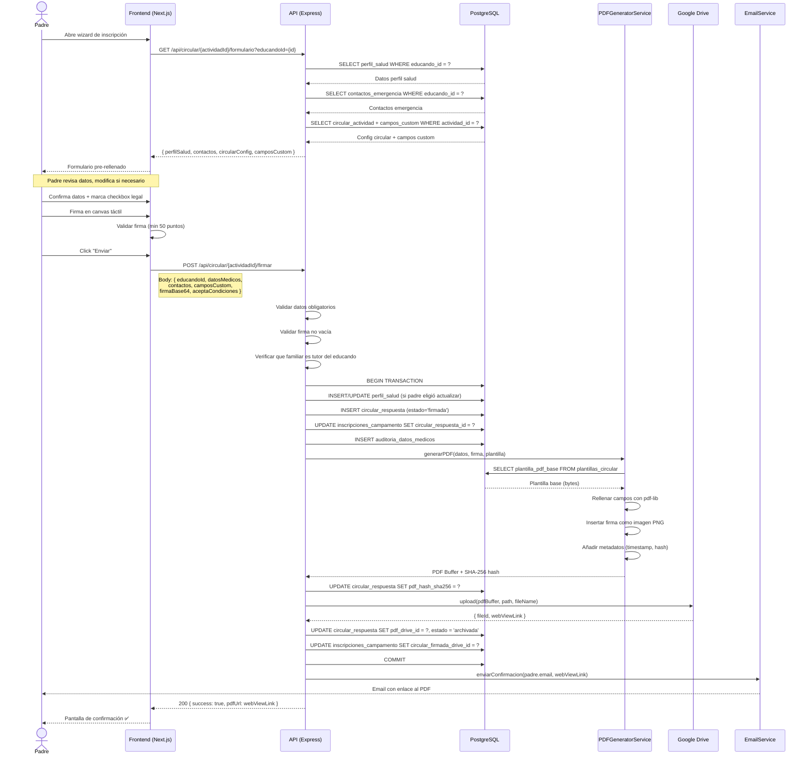
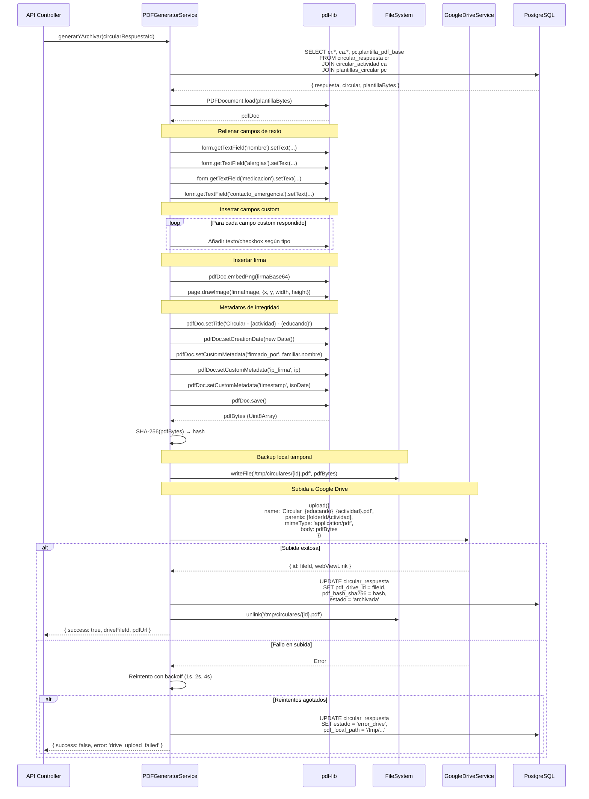
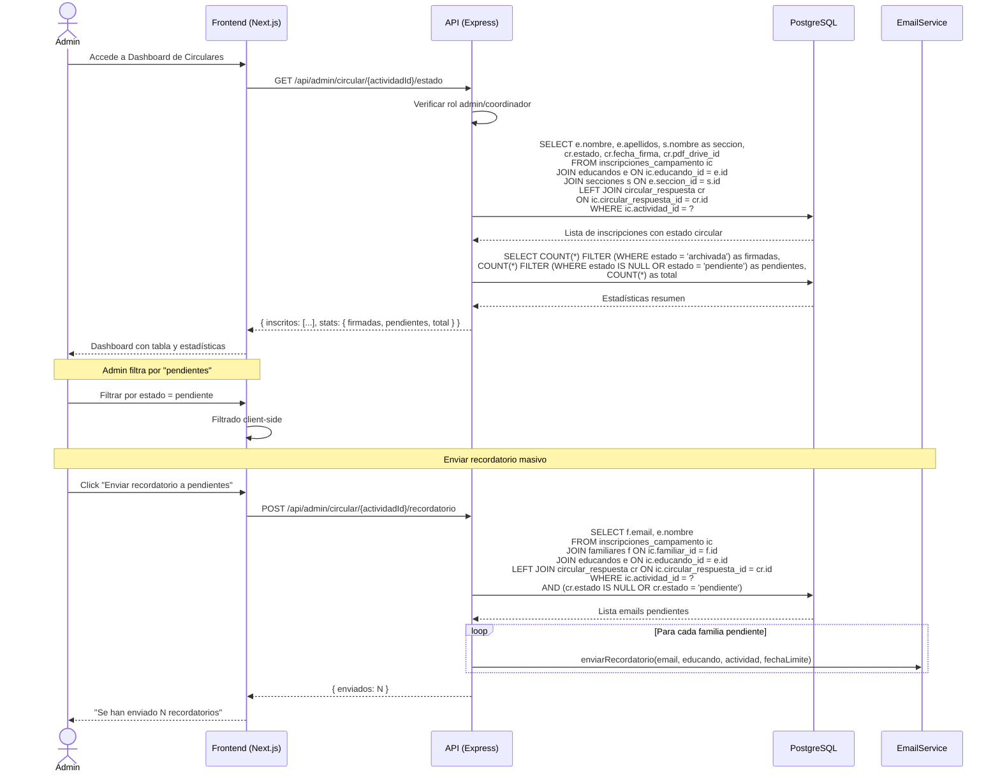
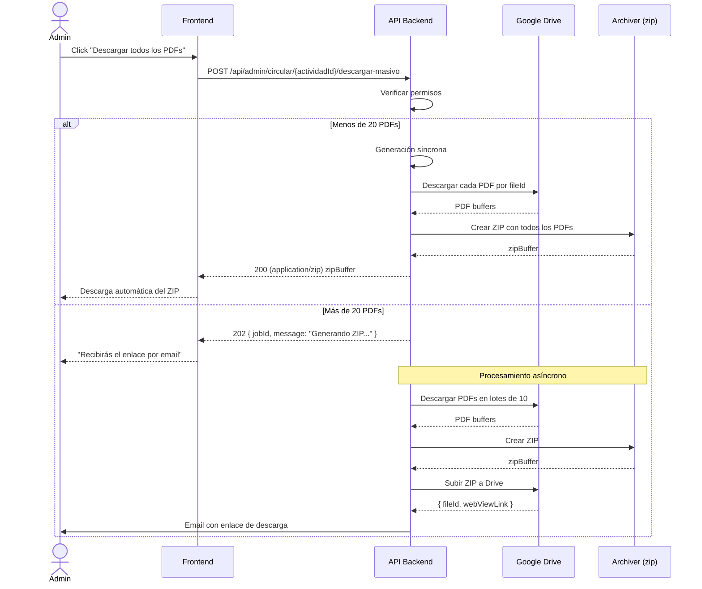
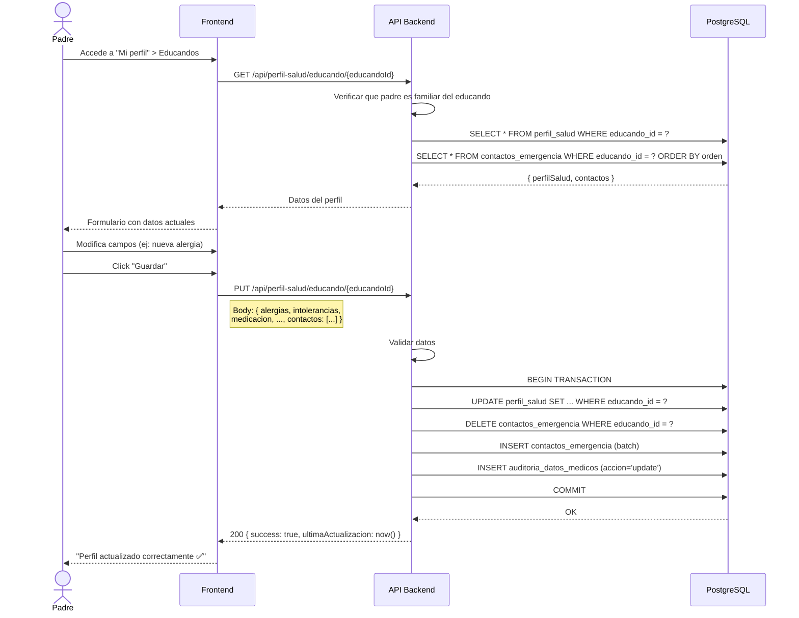

# Diagramas de Secuencia — Circular Digital

> Interacciones detalladas entre actores y componentes del sistema.

**Fecha:** 2026-02-01  
**Estado:** Draft  

---

## 1. Padre Confirma Circular

Flujo completo desde que el padre abre el formulario hasta que recibe confirmación.

---

## 2. Sistema Genera PDF Firmado (Detalle interno)

Secuencia detallada del servicio de generación de PDF.

---

## 3. Admin Consulta Estado de Circulares

---

## 4. Admin Descarga Masiva de PDFs

---

## 5. Padre Actualiza Perfil de Salud

