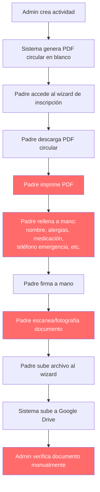
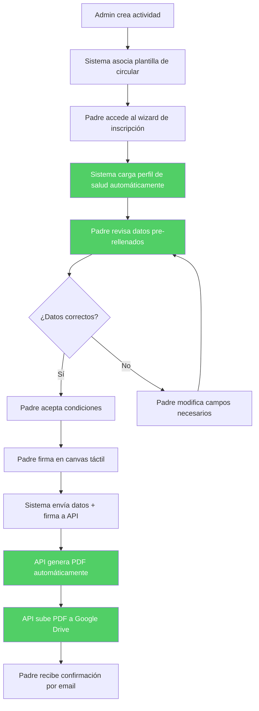
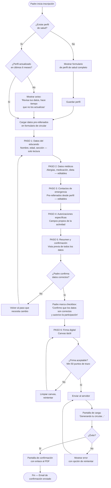
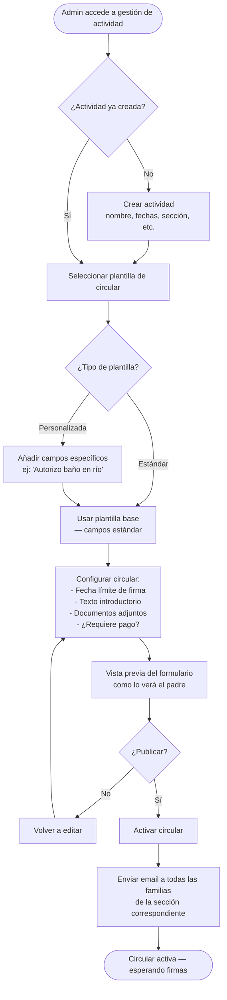

# User Flows — Circular Digital

> Diagramas de flujo completos para todos los actores y escenarios de la feature Circular Digital.

**Fecha:** 2026-02-01  
**Estado:** Draft  

---

## 1. Comparativa: Flujo Actual (PDF) vs Flujo Nuevo (Digital)

### 1.1 Flujo Actual (PDF — a deprecar)



**Tiempo estimado:** 15-20 minutos  
**Puntos de dolor:** Pasos en rojo son repetitivos, requieren hardware (impresora/escáner), propensos a errores.

### 1.2 Flujo Nuevo (Circular Digital)



**Tiempo estimado:** 1-2 minutos  
**Mejoras:** Pasos en verde son automáticos o simplificados.

---

## 2. Flujo del Padre: Confirmar Datos y Firmar Circular



### Edge Cases — Flujo del Padre

| # | Edge Case | Comportamiento |
|---|-----------|----------------|
| 1 | **Padre con múltiples educandos en la misma actividad** | Wizard permite seleccionar educando. Al completar uno, ofrece "¿Firmar circular para otro educando?" con datos del siguiente pre-rellenados. |
| 2 | **Pérdida de conexión durante la firma** | Los datos del formulario se guardan en localStorage. Al reconectar, se restaura el estado. La firma debe rehacerse. |
| 3 | **Padre modifica datos médicos que difieren del perfil** | Se pregunta: "¿Quieres actualizar tu perfil de salud con estos cambios?" Sí → actualiza perfil + circular. No → solo aplica a esta circular. |
| 4 | **Canvas de firma no soportado (navegador antiguo)** | Fallback: checkbox "Confirmo mi autorización" + campo de texto con nombre completo del firmante. Se registra como firma tipo "text" en vez de "image". |
| 5 | **Circular ya firmada, padre quiere modificar** | Si la actividad no ha comenzado y el admin no ha bloqueado cambios: permite re-firmar (nueva versión). Se archiva la anterior como "superseded". |

---

## 3. Flujo del Admin: Crear Circular para Actividad



### Edge Cases — Flujo del Admin

| # | Edge Case | Comportamiento |
|---|-----------|----------------|
| 1 | **Admin modifica circular después de publicada** | Si algún padre ya firmó: los que firmaron mantienen su versión. Los pendientes ven la nueva. Se notifica a los ya firmados si hay cambios sustanciales con opción de re-firmar. |
| 2 | **Actividad cancelada con circulares firmadas** | Se marca la actividad como cancelada. Las circulares se mantienen en Drive como archivo. Se envía email notificando la cancelación. |
| 3 | **Fecha límite alcanzada con firmas pendientes** | Dashboard muestra en rojo los pendientes. Admin puede: (a) extender plazo, (b) enviar recordatorio urgente, (c) excluir de la actividad. |
| 4 | **Dos admins editando la misma circular** | Optimistic locking: se guarda `updated_at`. Si hay conflicto, el segundo recibe error "La circular fue modificada. Recarga para ver los cambios." |
| 5 | **Admin necesita campo no contemplado en plantilla** | Puede añadir campos personalizados tipo texto libre, checkbox o select. Máximo 10 campos custom por circular. |

---

## 4. Flujo de Generación Automática del PDF

```mermaid
flowchart TD
    Start([API recibe datos confirmados + firma]) --> Validar[Validar datos:<br/>- Campos obligatorios presentes<br/>- Firma tiene min. 50 puntos<br/>- Educando pertenece al familiar]

    Validar --> ValidOK{¿Validación OK?}
    ValidOK -->|No| ReturnError[Retornar error 400<br/>con campos faltantes]

    ValidOK -->|Sí| PersistirDatos[Guardar en circular_respuesta:<br/>datos_confirmados, firma_base64,<br/>ip_firma, timestamp]

    PersistirDatos --> CargarPlantilla[Cargar plantilla PDF<br/>desde plantillas_circular]

    CargarPlantilla --> GenerarPDF[Generar PDF con pdf-lib:<br/>1. Cargar plantilla base<br/>2. Rellenar campos de texto<br/>3. Insertar firma como imagen<br/>4. Añadir metadatos de integridad]

    GenerarPDF --> HashPDF[Calcular SHA-256 del PDF]
    HashPDF --> GuardarHash[Guardar hash en circular_respuesta]

    GuardarHash --> SubirDrive[Subir PDF a Google Drive<br/>Carpeta: /Circulares/{Actividad}/{Sección}/]

    SubirDrive --> DriveOK{¿Subida OK?}
    DriveOK -->|No| Retry{¿Intentos < 3?}
    Retry -->|Sí| Wait[Esperar backoff exponencial<br/>1s, 2s, 4s]
    Wait --> SubirDrive
    Retry -->|No| GuardarLocal[Guardar PDF localmente<br/>Marcar para reintento posterior]
    GuardarLocal --> NotificarAdmin[Notificar admin:<br/>'Fallo subida Drive para X']
    NotificarAdmin --> ConfirmPadre

    DriveOK -->|Sí| ActualizarDB[Actualizar inscripción:<br/>circular_firmada_drive_id = file_id]

    ActualizarDB --> ConfirmPadre[Enviar email confirmación al padre<br/>con enlace al PDF en Drive]

    ConfirmPadre --> End([PDF generado y archivado])
```

### Edge Cases — Generación de PDF

| # | Edge Case | Comportamiento |
|---|-----------|----------------|
| 1 | **Plantilla PDF corrupta o no encontrada** | Log de error. Se usa plantilla genérica de backup. Se notifica al admin para corregir. |
| 2 | **Firma con muy pocos trazos (garabato)** | Validación frontend: mínimo 50 puntos. Validación backend: se comprueba que la imagen no esté vacía (>1KB). |
| 3 | **PDF generado excede límite de Drive (5MB)** | Comprimir imagen de firma a JPEG 80% calidad. Si aún excede, reducir resolución de la plantilla. |
| 4 | **Generación de PDF tarda >5s** | Timeout configurable. Si se excede, se encola como tarea asíncrona y se notifica al padre por email cuando esté listo. |
| 5 | **Dos peticiones simultáneas para el mismo educando/actividad** | Idempotencia: comprobar si ya existe circular_respuesta con estado 'firmada'. Si existe, retornar la existente. Si ambas llegan "a la vez", lock optimista con versión. |

---

## 5. Flujo del Admin: Consultar Estado de Circulares

```mermaid
flowchart TD
    Start([Admin accede al Dashboard]) --> SeleccionarActividad[Seleccionar actividad<br/>del listado]

    SeleccionarActividad --> CargarEstado[Cargar estado de circulares<br/>para todos los inscritos]

    CargarEstado --> MostrarDashboard[Mostrar tabla:<br/>Educando | Sección | Estado | Fecha firma]

    MostrarDashboard --> Filtrar{¿Aplicar filtros?}
    Filtrar -->|Sí| AplicarFiltro[Filtrar por:<br/>- Estado: pendiente/firmada/caducada<br/>- Sección<br/>- Búsqueda por nombre]
    AplicarFiltro --> MostrarDashboard

    Filtrar -->|No| Acciones{¿Acción?}

    Acciones -->|Ver detalle| VerDetalle[Ver datos confirmados<br/>+ firma + enlace PDF]
    Acciones -->|Enviar recordatorio| RecordatorioIndividual[Enviar email recordatorio<br/>a padre del educando]
    Acciones -->|Recordatorio masivo| RecordatorioMasivo[Enviar email a TODOS<br/>los pendientes de la actividad]
    Acciones -->|Descargar PDFs| DescargarZIP[Generar ZIP con todos<br/>los PDFs firmados]
    Acciones -->|Vista emergencia| VistaEmergencia[Mostrar resumen médico<br/>de todos los inscritos<br/>— vista optimizada para imprimir]

    VerDetalle --> MostrarDashboard
    RecordatorioIndividual --> MostrarDashboard
    RecordatorioMasivo --> MostrarDashboard
    DescargarZIP --> MostrarDashboard
    VistaEmergencia --> MostrarDashboard
```

### Edge Cases — Dashboard Admin

| # | Edge Case | Comportamiento |
|---|-----------|----------------|
| 1 | **Actividad sin ninguna inscripción** | Mostrar mensaje: "No hay inscritos en esta actividad todavía." Con botón para enviar invitación a la sección. |
| 2 | **Admin intenta enviar recordatorio a familia que ya firmó** | Botón deshabilitado para familias con estado "firmada". Si se intenta por API, retornar 409. |
| 3 | **Descarga masiva con >50 PDFs** | Generación asíncrona del ZIP. Se muestra progreso y se envía enlace de descarga por email cuando esté listo. |
| 4 | **Padre firmó pero luego se da de baja de la actividad** | Estado cambia a "anulada". El PDF se mantiene en Drive pero se mueve a subcarpeta "Anuladas". No se cuenta en estadísticas. |
| 5 | **Admin sin permisos para ver datos médicos** | Solo el coordinador de la actividad y super-admin ven datos médicos completos. Otros admins ven solo estado (pendiente/firmada). |
